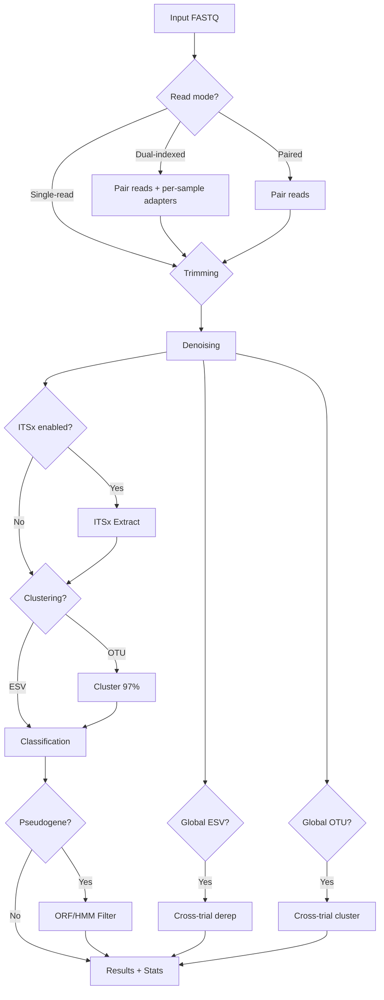

# MetaWorks Configuration Guide

This guide explains how to configure MetaWorks 2.0 pipeline runs using the profile-based configuration system.

---

## Table of Contents

1. [Quick Start](#quick-start)
2. [Configuration Overview](#configuration-overview)
3. [Profile System](#profile-system)
4. [Creating Your Config](#creating-your-config)
5. [Configuration Sections](#configuration-sections)
6. [Pipeline Data Flow](#pipeline-data-flow)
7. [Common Use Cases](#common-use-cases)
8. [Troubleshooting](#troubleshooting)
9. [Programmatic Configuration](#programmatic-configuration)

---

## Quick Start

### Option A: Use a Profile (Recommended)

```python
from lib.config.config_manager import ConfigManager

config = ConfigManager.load(
    profile="coi",
    workflow="esv",
    repo_root="/path/to/MetaWorks-2.0"
)
```

### Option B: Web UI

1. Select a **Profile** (e.g., "coi" for COI arthropods)
2. Select a **Workflow** (ESV or OTU)
3. Fill in your input directory and run name
4. Click "Submit Run"

### Option C: CLI with Config File

```bash
cat > my_run.yaml << EOF
input:
  fastq_dir: "tests/testing_data"
  sample_source: "folder"
EOF

snakemake --configfile config/defaults.yaml config/presets/coi.yaml my_run.yaml
```

---

## Configuration Overview

The configuration system uses three layers, merged in order:

```
┌─────────────────────────────────────┐
│   User Overrides                   │  ← Your minimal config
└─────────────────────────────────────┘
              ↓ merges with
┌─────────────────────────────────────┐
│   Profile Configuration            │  ← Marker-specific settings
└─────────────────────────────────────┘
              ↓ merges with
┌─────────────────────────────────────┐
│   Pipeline Defaults                │  ← config/defaults.yaml
└─────────────────────────────────────┘
```

Later layers override earlier ones. Most users only need to provide input data and choose a profile.

### Layer Responsibilities

| Layer | File(s) | Purpose | Edit? |
|--------|---------|---------|-------|
| **User Overrides** | Your YAML or API request | Your specific choices | Yes |
| **Profile** | `config/presets/*.yaml` | Marker-specific presets | Rarely |
| **Defaults** | `config/defaults.yaml` | Pipeline-wide defaults | Rarely |

---

## Profile System

Profiles are pre-configured settings for common marker genes. They dramatically reduce the amount of configuration needed.

### Available Profiles

#### Ready-to-use (validated with test data)

| Profile | Description | Marker |
|---------|-------------|--------|
| `coi` | COI arthropods | COI |
| `coi_vertebrate` | COI vertebrates | COI |
| `16s` | 16S rRNA bacteria/archaea | 16S |
| `28s` | 28S rRNA | 28S |
| `its` | ITS fungi | ITS |
| `12s` | 12S vertebrates | 12S |

#### Starter templates

| Profile | Description | Marker |
|---------|-------------|--------|
| `12s_fish` | 12S fish eDNA | 12S |
| `16s_vertebrate` | 16S vertebrates | 16S |
| `18s` | 18S eukaryotes | 18S |
| `18s_diatom` | 18S diatoms | 18S |
| `its_plants` | ITS plants | ITS |
| `rbcl` | rbcL (general) | rbcL |
| `rbcl_diatom` | rbcL diatoms | rbcL |
| `rbcl_landplant` | rbcL land plants | rbcL |

### Profile Contents

Each profile contains:

1. **Marker information** — The genetic marker type
2. **Classification settings** — Pre-configured classifier options
3. **Pseudogene filtering** — Appropriate genetic code and HMM settings

Example: `config/presets/coi.yaml`:

```yaml
profile:
  name: "coi"
  description: "COI metabarcoding for arthropods and invertebrates"
  marker: "COI"

classification:
  marker: "COI"
  rdp:
    use_custom_classifier: true
    classifier_path: "runtime/classifiers/COI.properties"

pseudogene_filtering:
  method: "hmm"
  genetic_code: 5  # Invertebrate mitochondrial
  hmm_profile: "config/hmm/bold.hmm"
  taxon1: "-e Arthropoda"
  taxon2: "-v Chordata"
```

### Using Profiles

#### Web UI

The Web UI includes a profile selector. Simply:
1. Choose your profile from the dropdown
2. Fill in input directory and run name
3. Submit!

#### API

```python
from lib.config.config_manager import ConfigManager

config = ConfigManager.load(
    profile="coi",
    workflow="esv",
    repo_root="/path/to/MetaWorks-2.0"
)
```

For API/UI use with dictionary overrides:

```python
config = ConfigManager.load_from_dict(
    profile="coi",
    workflow="esv",
    user_overrides={"input": {"fastq_dir": "/data/my_samples"}},
    repo_root="/path/to/MetaWorks-2.0"
)
```

#### CLI

```bash
snakemake \
  --configfile config/defaults.yaml \
  --configfile config/presets/coi.yaml \
  --configfile my_run.yaml
```

### Creating Custom Profiles

Create a new file in `config/presets/`:

```yaml
# config/presets/my_custom.yaml
profile:
  name: "my_custom"
  description: "My custom marker configuration"
  marker: "CUSTOM"

classification:
  marker: "CUSTOM"
  rdp:
    use_custom_classifier: true
    classifier_path: "runtime/classifiers/CUSTOM.properties"

pseudogene_filtering:
  method: "orf"
  genetic_code: 1
```

Then use it:

```python
config = ConfigManager.load(profile="my_custom", workflow="esv")
```

---

## Creating Your Config

### Step 1: Input Data

Tell MetaWorks where your data is:

```yaml
input:
  sample_source: "folder"      # "folder" (auto-detect) or "csv" (manual)
  samples_csv: "samples.csv"    # Required if sample_source="csv"
  fastq_dir: "data/reads"       # Directory with FASTQ files
```

| Option | When to Use | Description |
|--------|--------------|-------------|
| `folder` | Most cases | Auto-detects all FASTQ files in directory |
| `csv` | Special cases | Use `samples.csv` to specify exactly which files |

### Step 2: Choose Modules

Enable or disable pipeline modules using the 10 toggles from `config/defaults.yaml`:

```yaml
modules:
  trimming: true
  denoising: true
  clustering: false
  itsx_extraction: false
  classification: true
  classification_engine: "rdp"
  pseudogene_filtering: false
  stats: true
  global_esv: false
  global_otu: false
```

Module data flow:
1. Trimming → Denoising → Classification → Stats
2. Optional paths: Clustering (OTU mode), ITSx extraction, Pseudogene filtering
3. Post-classification: Global ESV, Global OTU (cross-trial analyses)

### Step 3: Configure Pipeline Settings

```yaml
pipeline:
  parallel_jobs: 4
  output_dir: "COI_results"
```

- `parallel_jobs`: Number of samples processed in parallel (depends on your resources, 1–32 recommended).
- `output_dir`: Optional override for the output directory. Defaults to `{WORKFLOW}_results` (e.g., `ESV_results` or `OTU_results`) if not specified.

### Step 4: Configure Module Parameters

#### Trimming

```yaml
trimming:
  read_mode: "paired"
  adapter_source: "file"
  adapters: "tests/adapters_anchored.fasta"
  adapter_csv: ""
  primer: ""
  process_as: "F"
  min_length: 150
  quality_cutoff: "20,20"
  error_rate: 0.1
  min_adapter_overlap: 3
  max_n_bases: 3
  enable_rc: true
```

For read-pairing parameters (quality score, overlap, mismatch, match), configure under `preprocessing:` — see below.

#### Preprocessing (read-pairing)

```yaml
preprocessing:
  quality_score: 13
  min_overlap: 25
  max_mismatch: 0.02
  min_match: 0.90
```

This is **not** a module toggle — it is a parameter section for read-pairing quality filtering, consumed by the trimming module's adapter_trimming rule.

| Parameter | Range | Effect |
|-----------|-------|--------|
| `quality_score` | 0–40 | Phred score cutoff for read merging |
| `min_overlap` | 10–100 bp | Minimum read overlap for pairing |
| `max_mismatch` | 0.0–0.5 | Maximum fraction mismatches in overlap |
| `min_match` | 0.0–1.0 | Minimum fraction matching in overlap |

**When to adjust:**
- Lower quality data → decrease `quality_score`
- Shorter amplicons → decrease `min_overlap`

#### Denoising

```yaml
denoising:
  pool_samples: true       # Pool all samples (better for rare ESVs)
  min_cluster_size: 8      # Minimum reads per ESV cluster
  threads: 4               # Number of threads
```

| Strategy | When to Use | Pros | Cons |
|----------|--------------|-------|-------|
| `pool_samples: true` | <100 samples, similar libraries | Better rare ESV detection | Slower |
| `pool_samples: false` | >100 samples, diverse libraries | Faster | May miss rare ESVs |

#### ITSx Extraction

```yaml
itsx_extraction:
  its_part: "ITS2"
  threads: 4
```

Enable with `modules.itsx_extraction: true`. When active, denoised sequences pass through ITSx to extract the specified ITS region before classification.

#### Clustering

```yaml
clustering:
  cluster_id: 0.97
  threads: 4
```

Enable with `modules.clustering: true`. Produces OTU clusters instead of ESVs.

#### Classification

```yaml
modules:
  classification: true
  classification_engine: "rdp"

classification:
  min_confidence: 0.8
  rdp:
    memory_gb: 20
    use_custom_classifier: true
    classifier_path: null
    builtin_classifier: "fungallsu"
  sintax:
    db_fasta: null
    cutoff: null
    threads: 4
```

Note the correct nested paths: `classification.rdp.use_custom_classifier` (not `classification.use_custom_classifier`).

**Engine selection** (one per run, set via `modules.classification_engine`):
- `"rdp"` — RDP Classifier (default)
- `"sintax"` — VSEARCH SINTAX with output converted to RDP-like table

| Option | When to Use |
|--------|-------------|
| `use_custom_classifier: true` | COI, 12S, rbcL, custom markers |
| `use_custom_classifier: false` | 16S, ITS fungi (built-in classifiers) |

#### Pseudogene Filtering (Optional)

```yaml
pseudogene_filtering:
  method: "hmm"                  # "hmm" or "orf"
  grep_type: 1                   # 1=simple, 2=compound
  taxon1: "-e Arthropoda"        # First grep pattern
  taxon2: "-v Chordata"          # Second grep pattern (compound only)
  hmm_profile: "config/hmm/bold.hmm"
  genetic_code: 5                # Genetic code (2 or 5 for COI)
  orf_start_codon: 2
  min_orf_length: 30
  ignore_nested_orfs: true
  strand: "plus"
```

| Method | Description | Best For |
|--------|-------------|-----------|
| `hmm` | HMM profile scoring | COI arthropoda, well-curated HMMs |
| `orf` | ORF length filtering | Any protein-coding gene |

| Genetic Code | Use For |
|-------------|---------|
| `2` | Vertebrate mitochondrial |
| `5` | Invertebrate mitochondrial |

#### Output

```yaml
output:
  report_type: 1                 # 1=combined CSV, 2=separate files
  include_intermediate: false     # Keep or delete intermediate files
  compress_output: true           # Gzip output files
  html_report: false              # Generate HTML report (not yet implemented)
```

| Type | When to Use | Output |
|------|--------------|--------|
| `1` (combined) | <100 samples | Single CSV with all results |
| `2` (separate) | 100+ samples | Separate ESV.table, taxonomy.csv, sequences.fasta |

---

## Configuration Sections

### Complete Example

```yaml
# MetaWorks User Configuration

input:
  sample_source: "folder"
  fastq_dir: "data/reads"

modules:
  trimming: true
  denoising: true
  clustering: false
  itsx_extraction: false
  classification: true
  classification_engine: "rdp"
  pseudogene_filtering: true
  stats: true
  global_esv: false
  global_otu: false

preprocessing:
  quality_score: 13
  min_overlap: 25

trimming:
  adapters: "adapters/COI.fasta"
  min_length: 150
  quality_cutoff: "20,20"

denoising:
  pool_samples: true
  min_cluster_size: 8

classification:
  marker: "COI"
  min_confidence: 0.8
  rdp:
    use_custom_classifier: true
    classifier_path: "runtime/classifiers/COI.properties"

pseudogene_filtering:
  method: "hmm"
  taxon1: "-e Arthropoda"
  taxon2: "-v Chordata"
  hmm_profile: "config/hmm/bold.hmm"
  genetic_code: 5

output:
  report_type: 1
  include_intermediate: false
  compress_output: true
```

---

## Pipeline Data Flow



**Standard path:** Trimming → Denoising → Classification → Results + Stats

**Single-read path:** No pairing step; trim single primer (`-g`/`-a`) directly, then denoise. Set `trimming.read_mode: "single"` and optionally `trimming.enable_rc: true` for R2 files.

**Dual-indexed path:** Pair reads → generate per-sample adapters from CSV → trim per-sample → denoise. Set `trimming.adapter_source: "csv"` and provide `trimming.adapter_csv`.

**ITS path:** Denoising → ITSx Extract → Classification (on ITS-region sequences) → Results

**OTU path:** Denoising → Cluster at 97% → Classification on centroids → Results

**Pseudogene path:** Classification → ORF/HMM filter → Results

**Global paths:** Cross-trial dereplication/clustering runs after individual trial results are complete.

---

## Common Use Cases

### Case 1: COI Invertebrates

```yaml
input:
  fastq_dir: "data/reads"

modules:
  pseudogene_filtering: true

classification:
  marker: "COI"
  rdp:
    use_custom_classifier: true
    classifier_path: "runtime/classifiers/COI.properties"

pseudogene_filtering:
  method: "hmm"
  taxon1: "-e Arthropoda"
  taxon2: "-v Chordata"
  hmm_profile: "config/hmm/bold.hmm"
  genetic_code: 5
```

Or simply use the `coi` profile and override just the input directory.

### Case 2: COI Vertebrates

```yaml
input:
  fastq_dir: "data/reads"

classification:
  marker: "COI"
  rdp:
    use_custom_classifier: true
    classifier_path: "runtime/classifiers/COI_vertebrates.properties"

pseudogene_filtering:
  method: "hmm"
  taxon1: "-e Chordata"
  genetic_code: 2
```

Or use the `coi_vertebrate` profile.

### Case 3: ITS Fungi with ITSx

```yaml
input:
  fastq_dir: "data/reads"

modules:
  itsx_extraction: true
  classification_engine: "rdp"

itsx_extraction:
  its_part: "ITS2"

classification:
  rdp:
    use_custom_classifier: false
    builtin_classifier: "fungalits_unite"
```

Or use the `its` profile (which may already include ITSx settings).

### Case 4: Large Dataset (100+ Samples)

```yaml
input:
  fastq_dir: "data/large_dataset"

pipeline:
  parallel_jobs: 8

denoising:
  pool_samples: false

output:
  report_type: 2
```

### Case 5: Low Quality Data

```yaml
preprocessing:
  quality_score: 10

trimming:
  quality_cutoff: "15,15"
  min_length: 100

denoising:
  min_cluster_size: 4
```

---

## Troubleshooting

### "Module X not found"

**Cause:** The module name does not match a key in the module registry.

**Solution:** Ensure the module name matches a key in `lib/config/module_registry.py`. Valid module names are: `trimming`, `denoising`, `clustering`, `itsx_extraction`, `classification`, `pseudogene_filtering`, `stats`, `global_esv`, `global_otu`.

### "No sequences after trimming"

**Cause:** Adapter file does not match your primers, or FASTQ files are in the wrong directory.

**Solution:**
1. Check `trimming.adapters` points to the correct adapter FASTA for your primers
2. Verify FASTQ files are in the directory specified by `input.fastq_dir`
3. Try decreasing `trimming.min_adapter_overlap` or increasing `trimming.error_rate`

### "Classifier path not found"

**Cause:** Custom classifier path does not point to an existing file.

**Solution:** If `classification.rdp.use_custom_classifier: true`, ensure `classification.rdp.classifier_path` points to an existing `.properties` file.

### Validation Errors

**Error:** `preprocessing.quality_score must be between 0 and 40`

**Solution:** Check parameter is within the valid range. See the parameter tables in [Step 3](#step-3-configure-module-parameters) for valid ranges.

### "Pipeline runs but produces no results"

**Checklist:**
1. Adapter file matches your primers
2. FASTQ files are in the correct directory
3. Classifier path is correct (if using custom classifier)
4. Quality thresholds are appropriate for your data
5. At least `modules.trimming`, `modules.denoising`, and `modules.classification` are enabled

### "Profile 'X' not found"

**Cause:** The profile name does not match any file in `config/presets/`.

**Solution:** List available profiles:

```python
from lib.config.config_manager import ConfigManager
manager = ConfigManager("/path/to/MetaWorks-2.0")
profiles = manager.list_available_profiles()
for p in profiles:
    print(f"  {p['name']}: {p['description']}")
```

---

## Programmatic Configuration

```python
from lib.config.config_manager import ConfigManager, load_config

# Full control with overrides
config = ConfigManager.load(
    profile="coi",
    workflow="esv",
    overrides={"input": {"fastq_dir": "/data/samples"}},
    repo_root="/path/to/MetaWorks-2.0"
)

print(config.merged["classification"]["min_confidence"])

# Export for workflow
config_dict = config.export_for_workflow()
```

Or using the convenience function:

```python
config = load_config(profile="16s", workflow="esv")
```

For API/UI use with dictionary input:

```python
config = ConfigManager.load_from_dict(
    profile="its",
    workflow="esv",
    user_overrides={
        "input": {"fastq_dir": "/data/samples"},
        "modules": {"itsx_extraction": True},
    },
    repo_root="/path/to/MetaWorks-2.0"
)
```
